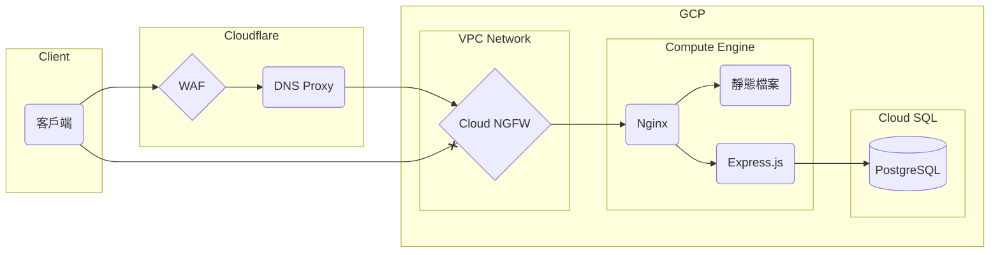

# 工作排程系統

## 初始化

### 環境變數

```dosini
DATABASE_URL=<string>
PORT=<number>
JWT_SECRET=<string>
```

### 安裝依賴

```bash
pnpm install -P
pnpm run -r prisma:generate
pnpm run -r prisma:migrate
```

## 系統架構



網站架設於 Google Cloud Platform 上，使用 Compute Engine 虛擬機運行。<br />
因雲端平台成本考量，本系統前後端皆使用同一個 Express app 提供服務。<br />
前端頁面為動態內容，由 Express app 提供服務。<br />
靜態內容放置於 `public` 資料夾，由 Nginx 提供服務。

Express app 使用 pm2 管理，確保服務持續運行。<br />
對外伺服器由 Nginx 提供服務，並使用 Let's Encrypt 提供的 SSL 憑證進行加密。<br />
Nginx 會將所有包含副檔名的請求導向 `public` 資料夾，其餘請求則導向 Express app。<br />
Nginx 設定可參閱[此連結](https://github.com/xzihnago/debian-quick-setup/blob/main/nginx/conf.d/example.conf)

客戶端與伺服端之間的連線使用 Cloudflare 的 DNS Proxy 保護<br />
原點防火牆規則僅允許來自 Cloudflare 的連線。<br />
限速規則為 20r/10s，超出將封鎖 10s。<br />
Cloudflare WAF 規則可參閱[此連結](https://github.com/xzihnago/debian-quick-setup/blob/main/cloudflare/waf.txt)

### 網頁詳細說明請參閱[文件](docs/README.md)
