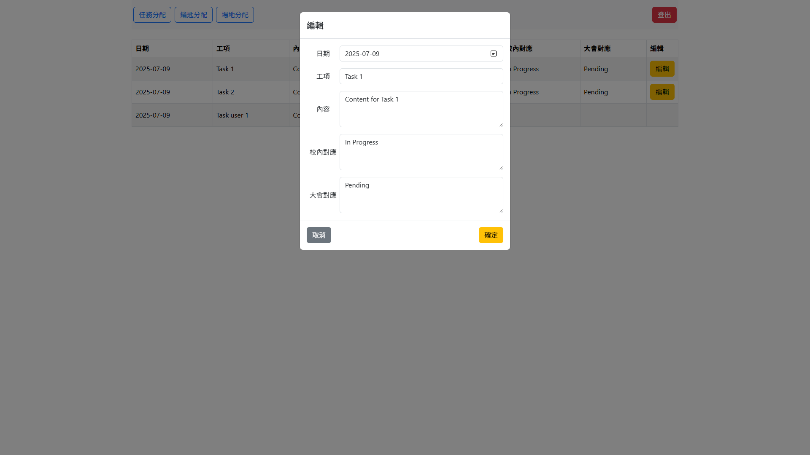

# 說明書

本系統為簡易的工作管理系統。<br />
包含四個頁面，分別為登入、任務分配、鑰匙分配與場地分配。<br />
有簡易 RWD 功能，可在不同裝置上正常顯示。

授權 token 的格式為 JWT，有效期限為 100 分鐘。每次操作都會重新簽發 token。

## API 說明

所有 API 皆使用 json 格式傳遞資料。<br />
所有 API 皆使用 `/api` 作為前綴。

所有 API 成功時，皆會回傳以下格式：

```ts
{
  data: any,
}
```

所有 API 失敗時，皆會回傳以下格式：

```ts
{
  error: any,
}
```

已處理之錯誤將會回傳指定的 `HTTP 4xx` 狀態碼。<br />
請求資料格式不正確時，將會回傳 `HTTP 422`。<br />
發生未處理錯誤時，將會回傳 `HTTP 500`。

<details>
<summary>/users</summary>

### POST `/users/login`

#### Request

本 API 無需授權。

```ts
{
  username: string,
  password: string,
}
```

#### Response

設定 cookie 中的 `token` 欄位，並導向 `/search` 頁面。<br />
失敗時將回傳 `HTTP 401`。

---

### GET `/users/logout`

#### Request

本 API 無需授權。

#### Response

清除 cookie 中的 `token` 欄位，並導向 `/` 頁面。

---

### GET `/users`

取得使用者名稱列表。

#### Request

本 API 需要授權，若授權無效將回傳 `HTTP 401`。

#### Response

```ts
{
  data: {
    id: string,
    nickname: string,
  }[];
}
```

</details>

---

<details>
<summary>/tasks</summary>

### GET `/tasks?year=:year`

取得指定年份的任務列表。

#### Request

本 API 需要授權，若授權無效將回傳 `HTTP 401`。

#### Response

```ts
{
  data: {
    editable: boolean,
    id: string,

    date: Date | null,
    title: string,
    content: string,
    responsibleId: string | null,
    internalStatus: string,
    externalStatus: string,
  }[]
}
```

---

### POST `/tasks/:year`

新增指定年份的任務。

#### Request

本 API 需要授權，若授權無效將回傳 `HTTP 401`。

#### Response

```ts
{
  data: {
    id: string,
    createdAt: Date,
    updatedAt: Date,
    year: number,

    date: Date | null,
    title: string,
    content: string,
    responsibleId: string | null,
    internalStatus: string,
    externalStatus: string,
  }
}
```

回傳新增後的任務資料。

---

### PUT `/tasks/:id`

更新指定任務。

#### Request

本 API 需要授權，若授權無效將回傳 `HTTP 401`。

#### Response

```ts
{
  data: {
    id: string,
    createdAt: Date,
    updatedAt: Date,
    year: number,

    date: Date | null,
    title: string,
    content: string,
    responsibleId: string | null,
    internalStatus: string,
    externalStatus: string,
  }
}
```

回傳更新後的任務資料。<br />
若使用者無權限修改該任務，將會回傳 `HTTP 403`。

---

### DELETE `/tasks/:id`

刪除指定任務。

#### Request

本 API 需要授權，若授權無效將回傳 `HTTP 401`。

#### Response

```ts
{
  data: {
    id: string,
    createdAt: Date,
    updatedAt: Date,
    year: number,

    date: Date | null,
    title: string,
    content: string,
    responsibleId: string | null,
    internalStatus: string,
    externalStatus: string,
  }
}
```

回傳刪除的任務資料。

</details>

---

<details>
<summary>/keys</summary>

### POST `/keys`

上傳鑰匙分配檔案。

#### Request

本 API 需要授權，若授權無效將回傳 `HTTP 401`。

表單中包含任意名稱欄位，檔案格式為單個圖片檔案，大小限制為 10MB。

| 欄位名稱 | 資料型態 | 說明               |
| -------- | -------- | ------------------ |
| \<any\>  | `File`   | 鑰匙分配的圖片檔案 |

#### Response

上傳成功時，將回傳 `HTTP 200`。<br />
若檔案大小超過限制，將回傳 `HTTP 413`。<br />

</details>

---

<details>
<summary>/venues</summary>

### POST `/venues`

上傳場地分配檔案。

#### Request

本 API 需要授權，若授權無效將回傳 `HTTP 401`。

表單中包含任意名稱欄位，檔案格式為單個 PDF 檔案，大小限制為 10MB。

| 欄位名稱 | 資料型態 | 說明                |
| -------- | -------- | ------------------- |
| \<any\>  | `File`   | 場地分配的 PDF 檔案 |

#### Response

上傳成功時，將回傳 `HTTP 200`。<br />
若檔案大小超過限制，將回傳 `HTTP 413`。<br />

</details>

## 頁面說明

以下是各頁面的截圖及說明。<br />
包含所有可能的錯誤訊息。

<details>
<summary>登入頁面</summary>

使用者可以輸入帳號密碼進行登入，若帳號密碼正確，則會導向任務分配頁面。<br />


若帳號密碼錯誤，則會顯示登入失敗訊息。<br />


</details>

---

<details>
<summary>任務分配</summary>

管理員可以在此頁面查看所有任務，並進行任務的分配。<br />


新增、修改或刪除任務時，使用相同的表單。<br />


使用者可以在此頁面查看所有任務，但無法進行任務的新增或刪除。<br />


使用者可以在此頁面修改負責人為自己的任務狀態，但無法修改負責人欄位。<br />


</details>

---

<details>
<summary>鑰匙分配</summary>

管理員可查看、修改場地鑰匙的分配情況。<br />


檔案大小限制為 10MB，若上傳的檔案超過限制，則會顯示錯誤訊息。<br />


使用者僅能查看場地鑰匙的分配情況。<br />


</details>

---

<details>
<summary>場地分配</summary>

管理員可查看、修改場地的分配情況。<br />


檔案大小限制為 10MB，若上傳的檔案超過限制，則會顯示錯誤訊息。<br />


使用者僅能查看場地的分配情況。<br />


</details>
